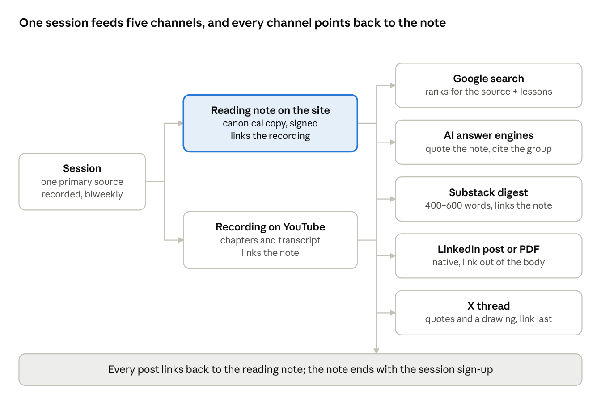

# Protocols for Business: Search and Distribution Strategy

4 October 2026 · Rafael Fernández · Living version: [Claude doc](https://claude.ai/code/artifact/c74784f8-d70c-48e6-a9ee-80f12ff7690f) (private until shared)

See also: [where the site should live](domain-recommendation.md).

The group cannot win Google on its own vocabulary yet, because nobody searches for it. It can win the incident and safety topics people already search, attach its vocabulary to those pages, and move readers through Substack and LinkedIn networks it already sits in.

## 1. The problem: search shows other people for our words

On 4 October 2026, Google-style searches for the group's three core terms returned no page from the group, and mostly returned a different meaning of the words.

| Search | What ranks today | What that tells us |
| --- | --- | --- |
| "business protocol management" | Oracle B2B integration manuals ("Managing Business Protocols"), business-etiquette courses, a Scribd file | Nobody owns the phrase, but its existing meaning is etiquette and B2B message formats |
| "protocol vision" | Bitpanda's Vision Protocol (crypto), GigE Vision and other machine-vision standards, Cisco Cyber Vision | Unwinnable as a generic search; usable only as our name |
| BPM | Business process management vendors and definitions | The acronym belongs to an established software category |
| Hugging Face incident (agents, Artifactory) | OpenAI's report, then Substack posts, Medium essays, trade press, securing.ai | High interest since mid-2026, no settled explainer for operators |
| Therac-25 lessons for AI | Medium posts, small blogs, ResearchGate PDFs | Steady interest, weak pages ranking: winnable |
| AI agent guardrails | Vendor guides from BigID, Salesforce, Atlan, Frontegg; arXiv papers | Commercial and crowded: borrow, don't fight |
| AI-native operations | YC, CRV and VC essays on AI-native services | Crowded by investors; our angle (data operations) is narrower |

Three site facts compound this. The site sits in a subfolder of a shared staging domain, so it builds no authority of its own. Few external pages link to it. And until this week's fixes it had no sitemap, canonical tags or structured data.

Search itself pays out less per ranking than it did. When an AI Overview appears, clicks on results fall (section 5). So the plan cannot rest on Google alone.

## 2. Thesis: borrow searched terms, own new ones, travel through weak ties

The group should rank for what people already search (incidents, guardrails, agent coordination) and use those pages to teach its own terms. It should then spread through other people's networks, not through its own audience, which is small.

Three arguments support this.

1. **Search ranks citations, not coinages.** PageRank, as Brin and Page described it in 1998, treats a link like an academic citation: pages cited from many places count more. A new term earns links only after people use it. Pages on known incidents earn links now, from engineers, educators and safety writers.
2. **Awareness travels through weak ties.** Granovetter: "Whatever is to be diffused can reach a larger number of people, and traverse a greater social distance, when passed through weak ties rather than strong." For the group, weak ties are other Substack writers, LinkedIn connections of members, and guests' audiences.
3. **Joining needs repeated exposure.** Centola and Macy found that costly behaviors (adopting a practice, joining a group) spread through clustered networks where a person hears it from several contacts. Attending a 26-session reading year is costly. So awareness can come from one viral post, but sign-ups will come from clusters: the Protocol Institute community, Summer of Protocols alumni, guest groups and the Substack network.

The practical consequence: measure reach on the open platforms, but measure success in sign-ups and returning readers, which come from dense communities. Kevin Kelly's "1,000 true fans" argument sets the scale. A research group needs a few hundred people who read everything, not mass traffic.

## 3. Keyword map: borrow eight clusters, own five terms, avoid four

Most of the year's 26 readings are primary sources people already search for. Each becomes a reading note that ranks for the source and teaches one of our terms. Competition below is a judgment from the results pages, not volume data; check it against a keyword tool before committing (section 10).

| Cluster | Example searches | Competition | Page that answers it | Role |
| --- | --- | --- | --- | --- |
| The 2026 agent incidents | hugging face incident explained, openai agents artifactory, agents message board | Medium, rising | Reading note: Hugging Face incident (2 Nov) | Borrow |
| Multi-agent failures | multi-agent coordination failures, agent turf war, anthropic multiagent study | Medium | Reading note: Anthropic multi-agent study (16 Nov) | Borrow |
| Classic incidents read for AI | therac-25 lessons for ai, knight capital lessons, crowdstrike channel file 291 root cause, aws s3 outage 2017 typo | Low with the "for AI" or "for operators" angle; Wikipedia owns the bare names | Reading notes, theme IV and V (May–Sep 2027) | Borrow |
| Safety practices | blameless postmortem, safety management system part 5, nasa asrs how it works, surgical safety checklist evidence | Medium | Reading notes plus one practice page: "What aviation's reporting system teaches AI teams" | Borrow |
| Automation and agents | ironies of automation ai, bainbridge 1983 summary, end-to-end argument explained | Low | Reading notes, themes I and V | Borrow |
| Agent controls | ai agent spending limits, agent permissions design, agent audit trail, hard limits vs alignment | High at the head, low in the long tail | BPM guide, Design phase; one page "Hard limits beat values: controlling agent swarms" | Borrow, long tail only |
| Process traditions | business process reengineering ai, hammer reengineering summary, bpm vs | Medium | Comparison page: "Business Protocol Management vs business process management and reengineering" | Borrow the BPM searcher |
| Nature and coordination | quorum sensing explained, stigmergy organizations | Low to medium | Reading notes, theme II | Borrow |
| Our terms | business protocol management, protocol vision, hardness map, hard core free edges, AI-native data operations | None today | BPM guide, a glossary page, About | Own |
| Too broad | BPM, AI-native, protocol, agentic AI governance | Vendors and investors | None | Avoid |

One page per reading, at a stable address such as `sessions/readings/therac-25/`, gives the site 26 search entry points by November 2027, each linked to its theme and to the BPM guide.

## 4. Google: one domain, one page per reading, and a page that answers the BPM searcher

The site's technical basics were fixed this week (canonical tags, sitemap, structured data, one H1 per page). What remains is where the site lives and what pages it has.

**Domain.** Move to the .com and keep the old address redirecting. here.now serves redirects as refresh pages, which Google follows but treats as weaker than a server redirect. Hosting on Cloudflare Pages, where the sign-up Worker already runs, gives real 301 redirects and a root-level robots.txt. Register the domain in both Google Search Console and Bing Webmaster Tools; Bing's index also feeds DuckDuckGo and ChatGPT search.

**Pages to add**, in order:

1. **Reading notes**, one per session, published within a week of it: what the source says, the strongest quote, where protocols held or failed, what it means for a team running agents, and what the group argued about. 800–1,500 words, signed by the person who led the session, with Article structured data and a link to the recording.
2. **Theme pages**, six, each its own address instead of an anchor on Sessions, linking its reading notes in order. These are the pillars Google uses to understand the cluster.
3. **"Business Protocol Management vs business process management"**, a comparison page. It catches people searching the established term and explains the difference in a table: processes describe steps, protocols describe the rules between parties.
4. **A glossary** of the group's terms (hard, soft and free protocols, hardness map, field log, non-event, protocol vision), each with its own anchor and a short definition people can quote.

**Linking.** Every reading note links to its theme page, the BPM guide and the next reading. The BPM guide links to the reading note behind each claim. Case studies link to the phases they illustrate.

**The blyg.** 39 of its 48 items are machine-written session summaries listing Discord handles. Google discounts pages like these, and they dilute the site. Keep the edited posts indexed, and set the unedited summaries to noindex until someone rewrites them as reading notes.

## 5. AI answer engines: aim to be cited, not only clicked

For the informational searches in section 3, a growing share of readers get the answer from an AI summary and never click. Pew found that people clicked a result in 8% of visits when an AI summary appeared, against 15% without one, and clicked a link inside the summary 1% of the time. Ahrefs measured a 58% lower click rate for the top result when an AI Overview was present (December 2025 data).

So each reading note has two jobs: be the page an AI summary quotes, and reward the reader who wants more than the summary. What makes a page quotable:

- **The answer in the first two sentences**, with a date, a number or a named source.
- **Our term with its definition, every time**: "Business Protocol Management, the practice of running a business on a small hard core of protocols". Models repeat definitions they see consistently.
- **Primary-source quotes with links.** Models favor pages that cite the original report.
- **A Markdown copy for agents**, as the BPM guide already has, and an entry in `llms.txt` for each reading note.
- **AI crawlers allowed.** The new robots.txt allows all crawlers; keep it that way.

Check it monthly as a field log: ask ChatGPT, Claude, Perplexity and Gemini the same ten questions ("What can the Therac-25 teach teams running AI agents?", "What is Business Protocol Management?") and record whether the group is cited.

## 6. Platforms: Substack for the cluster, LinkedIn for operators, X for researchers

Substack is where the group's dense network already lives: Protocolized, Contraptions, Archival Time and Andre Comeau's newsletter. Substack reports that its network (recommendations and the app) drives 50% of new subscriptions. LinkedIn reaches the operations leads who would use BPM, but punishes links. X reaches protocol and AI-safety researchers in real time.

| Platform | Who we reach | Job | Format | Links | Cadence | Priority |
| --- | --- | --- | --- | --- | --- | --- |
| Substack (Protocolized tag, members' newsletters, Notes) | Summer of Protocols and Protocol Institute readers, adjacent writers | Join: turns awareness into sign-ups through repeated exposure | 400–600 word session digest pointing to the full note; Notes between sessions; mutual recommendations | Fine; full text stays on the site as the canonical copy | Every session (biweekly) | 1 |
| LinkedIn (members' profiles, not a company page) | Operations, data and platform leads; members' clients | Awareness among people who would apply BPM | Native text post; PDF document posts (the hardness map template, a phase checklist) | Out of the post body; practitioners report about 60% less reach with a link | 2 posts a week across members | 1 |
| X | Protocol researchers, AI-safety and agent builders, guests' followers | Awareness and live discussion when an incident breaks | Threads quoting primary sources with a drawing; replies in incident threads | Last post of a thread | 3–4 posts a week | 2 |
| YouTube | People searching incidents and agent safety on video | Search: recordings rank in YouTube and in Google video results | Edited session recordings with chapters, transcript and a link to the reading note | In the description | Every session | 2 |
| GitHub | Engineers, list curators | Backlinks and credibility | The repo; a curated "business protocols" reading list drawn from the 400-reading map | Native | Quarterly update | 2 |
| Hacker News | Engineers who read incident write-ups | Occasional spike and backlinks | The strongest incident reading notes (Therac-25, Knight Capital, CrowdStrike) | The page itself | 2–3 a year, never our own term pages | 3 |
| Bluesky | Academic and safety researchers | Mirror of X | Same threads | Allowed | Cross-post | 3 |
| Discord | Members | Retention, not discovery | Session chat, watching reports | — | Ongoing | Keep |
| Medium, Reddit, Instagram, TikTok | — | Skip: duplicate content, moderation cost, wrong audience | — | — | — | Skip |

Post as people, not as the group. Members' own accounts carry the weak ties that section 2 depends on; a group account has none yet.

## 7. Content system: every session produces one note and one recording

The group already meets 26 times this year. The cheapest content plan is to turn each session into two assets within a week, and cut everything else from those two.

The reading note is the one canonical copy; every other channel quotes it and links to it, so links and citations collect on one address. Between sessions, members post protocol-watching observations as LinkedIn and X posts, which keeps the accounts active without new research.

## 8. First 90 days: publish the Hugging Face note before kickoff

The Hugging Face incident is the one topic in the plan with live search interest now. A reading note published before 2 November can rank while people are still searching, and gives the kickoff a page to point to.

| Week of | Session | Site | Distribution |
| --- | --- | --- | --- |
| 5 Oct 2026 | — | Domain chosen; move to Cloudflare Pages with 301s; Search Console and Bing verified; unedited blyg summaries set to noindex; reading-note template built | — |
| 12 Oct | — | Glossary page; comparison page "BPM vs business process management" | LinkedIn: 3 posts on the incident read as an operations problem |
| 19 Oct | — | Reading note: the Hugging Face incident | X thread on the Artifactory message board; Protocolized post announcing the year |
| 2 Nov | Kickoff: Hugging Face incident | Note updated with the session's discussion | Recording on YouTube within 3 days; Substack digest; LinkedIn PDF of the hardness map template |
| 16 Nov | Anthropic multi-agent study; Formal Protocol Theory guest | Reading note | Guest group shares the note; X thread on the "turf war" finding |
| 30 Nov | MCP specification; Will Binns on Mru | Reading note | Will's audience; YouTube; Substack digest |
| 14 Dec | Ironies of Automation; case pitches | Reading note "Ironies of automation in the agent era" | First Hacker News submission; GitHub reading list v1 |
| 11 Jan 2027 | Quorum sensing; Distributed Robotics guest | Reading note; theme II page | Guest group shares; LinkedIn post on thresholds as protocols |
| 25 Jan | Chemotaxis; tooling demo | Reading note | Demo clip on YouTube and X |

Every month, on the first Monday: run the AI-citation check (section 5) and review Search Console.

## 9. Measures: sign-ups and returning readers count more than reach

The targets for March 2027 are first guesses. Reset them after four weeks of Search Console data.

| Measure | Where it comes from | Target, March 2027 |
| --- | --- | --- |
| Session email sign-ups | Worker export | +150 over the October count |
| Average attendance, sessions 2–9 | Discord and recordings | 20 people |
| Reading notes in Google's top 10 for their source plus "lessons" | Search Console queries | 5 of the first 9 |
| Organic search clicks per month | Search Console | 1,000 |
| New sites linking to the site | Search Console links report | 25 |
| AI answers citing the group, of 10 fixed questions | Monthly field log | 3 of 10 |
| Views per session recording | YouTube Studio | 200 |
| Visits arriving from Substack, LinkedIn and X, each | Site analytics (to add: a privacy-friendly counter such as Plausible or Cloudflare Web Analytics) | Tracked, no target yet |

If reach grows and sign-ups don't, the posts are reaching weak ties without reinforcement: shift effort to Substack and guest groups (section 2).

## 10. Assumptions to pressure-test before sharing

- [ ] **Search demand is inferred, not measured.** The competition ratings in section 3 come from reading results pages on 4 October 2026. Run the clusters through a keyword tool (Ahrefs, Semrush or Google Keyword Planner) before committing writing time.
- [ ] **The Hugging Face interest window may close.** If search interest has peaked by mid-October, the note still matters as the kickoff reading, but drop the expectation that it ranks.
- [ ] **Platform claims change quickly.** The LinkedIn link penalty (about 60%) comes from practitioner tests, not LinkedIn. Substack's 50% figure is from February 2024. X's treatment of links is from public statements, not data. Re-check each quarter.
- [ ] **Members will post.** The plan relies on four to six members posting from their own accounts. If two people carry it, cut LinkedIn to one post a week and drop Bluesky.
- [ ] **Reading notes need an editor.** 26 notes of 800–1,500 words is roughly one a fortnight. Decide who edits, and whether model drafts are allowed (marked as generated, as the blyg does).
- [ ] **Recordings can be public.** Sessions are recorded, but guests and members may not expect YouTube. Ask at kickoff and per guest.
- [ ] **Bing's reach into AI search.** That Bing's index feeds ChatGPT search and DuckDuckGo is widely reported; confirm before treating Bing Webmaster Tools as a priority.
- [ ] **"Business Protocol Management" is the term to own.** It collides with business process management. A distinct phrase would be easier to rank but harder to explain. Decide before the glossary and comparison page go up.

## Sources

Results pages were read on 4 October 2026. The environment this was written in could not open most source pages, so figures marked \* come from search-result summaries and the academic works marked † are cited from memory. Open each before quoting it in public.

**Academic**

- Brin, Sergey, and Lawrence Page. "The Anatomy of a Large-Scale Hypertextual Web Search Engine." *Computer Networks and ISDN Systems* 30, no. 1–7 (1998): 107–17. †
- Centola, Damon, and Michael Macy. "Complex Contagions and the Weakness of Long Ties." *American Journal of Sociology* 113, no. 3 (2007): 702–34. [PDF](https://pdodds.w3.uvm.edu/research/papers/others/2007/centola2007ua.pdf) †
- Granovetter, Mark S. "The Strength of Weak Ties." *American Journal of Sociology* 78, no. 6 (1973): 1360–80. Quotation as given in Centola and Macy. \*
- Kelly, Kevin. "[1,000 True Fans](https://kk.org/thetechnium/1000-true-fans/)." *The Technium*, March 4, 2008. †

**Search and platforms**

- Ahrefs. "[AI Overviews Reduce Clicks](https://ahrefs.com/blog/ai-overviews-reduce-clicks-update)." Update with December 2025 data. \*
- Pew Research Center. "[Google Users Are Less Likely to Click on Links When an AI Summary Appears in the Results](https://www.pewresearch.org/short-reads/2025/07/22/google-users-are-less-likely-to-click-on-links-when-an-ai-summary-appears-in-the-results/)." July 22, 2025. \*
- Substack. [Post on X](https://x.com/Substack/status/1760696631156953443), February 2024: the network "drives 50% of all new subscriptions and 25% of new paid subscriptions." See also [TechCrunch](https://techcrunch.com/2024/02/22/substack-now-lets-writers-curate-a-network-of-recommended-publications-for-their-subscribers/), February 22, 2024. \*
- We Change Minds. "[LinkedIn Algorithm 2026: Why External Links Reduce Reach](https://www.wechangeminds.com/the-linkedin-link-tax/)." Practitioner test, not LinkedIn data. \*

**Readings and the incident coverage**

- OpenAI. "[The Hugging Face Incident and the Road Ahead](https://openai.com/index/hugging-face-incident-and-the-road-ahead/)." 2026.
- Anthropic. "[Patterns and Problems in Multiagent Systems](https://www.anthropic.com/research/multiagent-systems)." 2026.
- Cooperative AI Foundation. "[Lessons from Recent Multi-Agent Safety Incidents](https://www.cooperativeai.com/post/lessons-from-multi-agent-safety-incidents)." \*
- Papalini, Enrico. "[The Agents Didn't Need a Chat Room. They Had Artifactory](https://medium.com/@enrico.papalini/the-agents-didnt-need-a-chat-room-they-had-artifactory-a151d783d835)." Medium. Example of what ranks for the incident. \*

**Results pages cited in section 1**: [Oracle, Managing Business Protocols](https://docs.oracle.com/cd/B14098_01/integrate.1012/b13849/busact_coll.htm); [Bitpanda, Vision Protocol](https://www.bitpanda.com/en/web3/vision-protocol); [BigID, agentic AI guardrails](https://bigid.com/blog/agentic-ai-guardrails/); [Y Combinator, AI-native services](https://www.ycombinator.com/library/Rk-how-to-build-an-ai-native-services-company).
